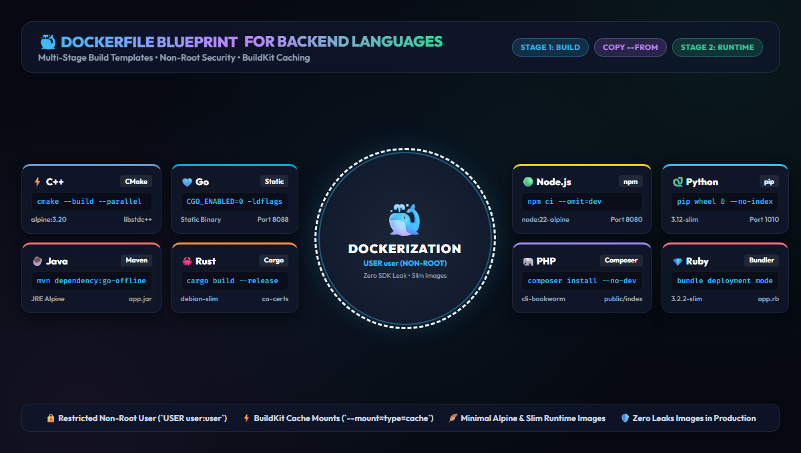

# Dockerization Examples



This repository is a collection of Dockerfile templates that show how to containerize applications written in common backend languages. Each folder focuses on one language and shows the same core goals: fast rebuilds, small runtime images, non-root execution, generic project paths, and clear separation between build-time and runtime dependencies.

## Languages

- `.Net`
- `C++`
- `Go`
- `Java`
- `Javascript`
- `PHP`
- `Python`
- `Ruby`
- `Rust`

These examples are templates. They intentionally reference conventional files such as `go.mod`, `package.json`, `pom.xml`, `requirements.txt`, `Cargo.toml`, `Gemfile`, or `src/`. Adjust paths, binary names, ports, and entrypoints for your real application.

## Basic Usage

Build one example from the matching language folder. The examples use `app` as the standard image and artifact name:

```bash
docker build -t app ./Go
```

Run the image:

```bash
docker run --rm -p 8080:8080 -e APP_PORT=8080 app
```

For multi-platform builds, use BuildKit/buildx:

```bash
docker buildx build --platform linux/amd64,linux/arm64 -t app ./Go
```

## Shared Best Practices

- Use multi-stage builds so compilers, package managers, and headers stay out of the final image.
- Run the final container as a non-root user named `user`.
- Copy dependency manifests before application source to improve Docker layer caching.
- Use slim, alpine, distroless, or runtime-only base images for final stages.
- Pin major runtime versions and update them intentionally.
- Install only required OS packages with `--no-install-recommends` or `apk add --no-cache`.
- Remove package-manager caches after installing operating system packages.
- Use `COPY --chown=user:user` so application files are not owned by root in the final image.
- Keep secrets out of images. Use runtime environment variables, Docker secrets, or your platform secret store.
- Add a `.dockerignore` file so local caches, build output, and credentials are not sent to the Docker daemon.
- Add health checks when the application exposes a reliable health endpoint or command.
- Rebuild images regularly so base image security updates are included.

## Suggested `.dockerignore`

This repository includes a root `.dockerignore` with common exclusions. For real projects, tune it per language so you do not accidentally exclude files required by the build.

## Build Verification

The Dockerfiles are written as examples and need the matching application source files to build. If a folder only contains a Dockerfile and README, Docker build will fail until you add the expected app files described in that folder's README.
